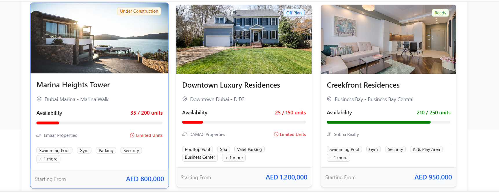
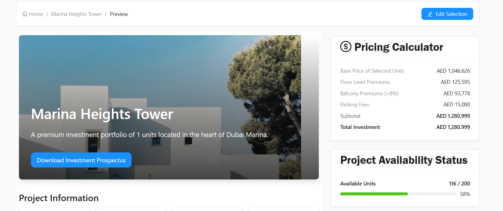
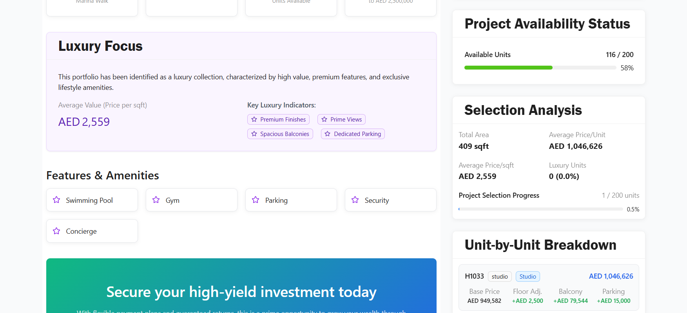
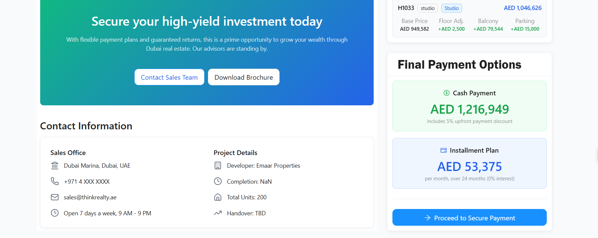
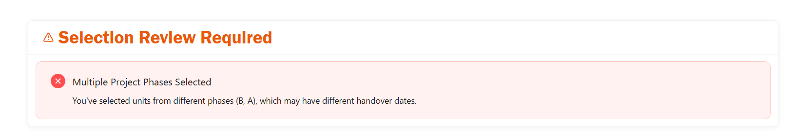
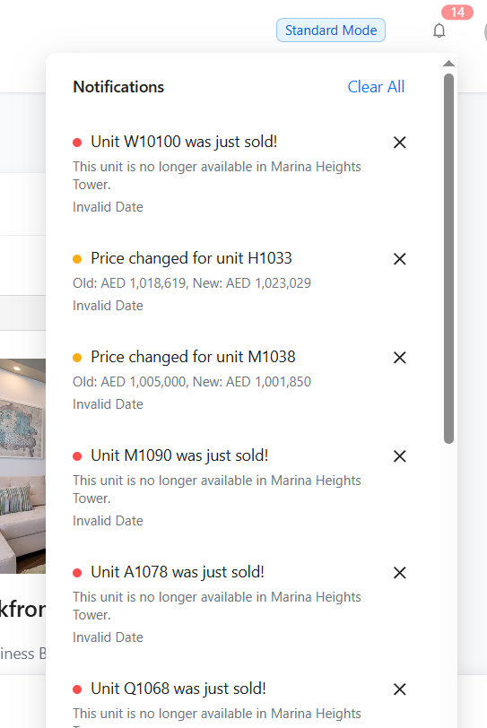
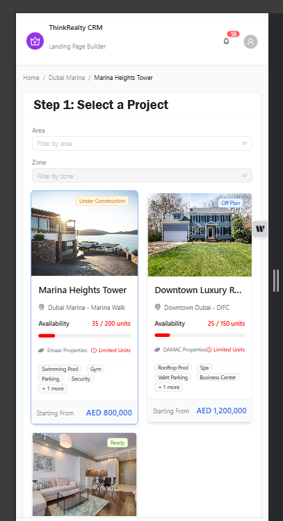
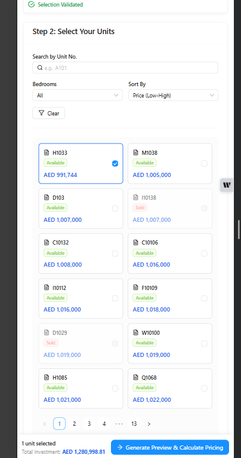

1. Instructions

<!-- ThinkRealty CRM - Dynamic Landing Page Builder: -->

This repository contains a sophisticated front-end application designed to simulate a dynamic landing page builder for a real estate CRM. The application implements complex, interconnected business rules for pricing, availability, and content personalization, all managed through a robust Redux state management architecture.
The project demonstrates advanced state management techniques, including handling asynchronous events, resolving data conflicts, and dynamically adapting the UI based on user selections and context.

<!-- 2.1 Setup Instructions: -->

### Prerequisites

Node.js (version v18.x or later is recommended)
npm or yarn

### Installation

1. Clone the repository
2. Install dependencies: npm install
3. uRnning the Application
   To start the development server, run the following command: npm run dev
   The application will be available at http://localhost:5173 (or the next available port).

### Environment Variables:

No .env file or special environment variables are needed to run this application. All data is mocked and included within the source code.

<!-- 2.2 Technology Stack -->

The project was built using a modern, efficient, and scalable front-end stack.

1. Core -> React -> ^18.2.0 -> The core UI library.
   Vite -> ^5.2.0 -> Next-generation front-end tooling for development.
   React Router DOM -> ^6.22.3 -> For client-side routing and navigation.
2. State Management -> Redux Toolkit -> ^2.2.3 -> The official, opinionated toolset for Redux.
   React-Redux -> ^9.1.0 -> Official React bindings for Redux.
3. UI & Styling -> Ant Design (antd) -> ^5.17.0 -> A high-quality React UI component library.
   Tailwind CSS -> ^3.4.1 -> A utility-first CSS framework for rapid styling.
4. Icons -> Lucide React -> ^0.378.0 -> A beautiful and consistent icon set.

<!-- 2.3 Assumptions Made -->

To deliver a functional application based on the complex requirements, several logical assumptions and simplifications were made.

### Business Logic Assumptions

### Unit Base Price:

The requirements detailed premiums and discounts but did not specify how a unit's base price is determined. It is assumed that the price field in the mock data represents the starting base price before any of our dynamic calculations are applied.

### "Similar Units" for High Demand:

The rule to mark "similar units" as high-demand was ambiguous. The implemented logic assumes "similar units" are any other available units within the same zone that have an equal or greater number of bedrooms.

### API and Backend Simulation:

All backend operations (price changes, concurrent reservations) are simulated on the client-side using setInterval within a useEffect hook. In a real-world scenario, this would be replaced by WebSocket connections or periodic API polling.

### Common Area Ratio:

The validation rule for "common area ratio" was abstract. A simplified, testable rule was implemented: a validation warning is triggered if the total selected area exceeds a conceptual limit (e.g., 5000 sqft), simulating an unusually large portfolio selection. A commonAreaRatio property was added to mock projects for this purpose.

Simplifications

### Conflict Resolution:

The requirement was to "offer merge options" on a conflict. This was simplified to an alert-and-update system. The application notifies the user of the conflict (e.g., a unit was sold) and immediately updates the UI to reflect the new state (e.g., disabling the sold unit). The UI for user choices ("Find a similar unit") was not implemented.

### Authentication and Users:

The application has UI elements for a user profile but no actual authentication system. The concept of "concurrent users" is entirely simulated.

<!-- 2.4 Screenshots and Descriptions -->

Here are key screens demonstrating the application's core features.

### Project Selection Interface

**Description:**
The initial view where the user can filter and select a project. The cards are designed to be visually appealing and data-rich, showing an image, location, price range, and a progress bar for unit availability.

### Unit Selection & Dynamic Sidebar

[alt text](./src/assets/image-1.png)

**Description:**
After selecting a project, the user can choose individual units. The right-hand sidebar updates in real-time, showing a detailed pricing breakdown (Scenario 1) and the project's availability status, including any active reservation timers (Scenario 2).

### Validation System in Action

**Description:**
shows the validation system at work. The user has selected units from two different phases, triggering a critical error. The ValidationReport component appears above the unit grid to inform the user, and the "Generate Preview" button in the sticky footer is disabled, preventing them from proceeding with an invalid selection.

### Smart Notification System

**Description:**
The background simulator has triggered a price change on a selected unit. The SmartNotificationCenter in the header shows a badge indicating new alerts. The corresponding unit card in the grid below would simultaneously display a "Price Updated!" warning.

### 5. Mobile Adaptive View

'

**Description:** >When the screen size is reduced, the UnitMultiSelect component automatically switches to a compact view. This adaptive layout optimizes the user experience for mobile devices by presenting the most critical information in a space-efficient manner.

<!-- 2.5 Incomplete Items and Future Approach -->

While the core functionality is complete, some advanced features and polishing items were not implemented due to time constraints.
![Incomplete_Feature]

### Conflict Resolution UI:

The current system detects conflicts and notifies the user. The next step is to create a ConflictResolutionModal.jsx component. When a critical conflict occurs (e.g., a selected unit is sold), dispatch an action to open this modal. The modal would offer the user clear choices, such as "Remove Unit from Selection" or "Find a Similar Unit," which would then dispatch the appropriate follow-up actions.

## Focus Mode Layout

        The application can detect when timers are active but doesn't change the UI. The approach would be to update the Redux slice to set layoutMode: 'focus' when a timer starts. Components would then subscribe to this state and conditionally apply CSS classes (e.g., opacity-50 transition-opacity) to de-emphasize non-essential elements like the ProjectSelector or parts of the content preview.

### Intelligent Debouncing

    	Calculations currently run on every single click. To optimize performance, the dispatch calls in handleUnitsChange should be wrapped in a debounced function using a library like lodash.debounce. This function, created with useCallback, would delay the expensive updatePricing and validateSelection dispatches until the user has stopped selecting units for a brief period (e.g., 300ms).

<!-- 2.6 Time Tracking -->

<Total Time Spent: Approximately 3 days.

[Breakdown:]

1st Day: Reseach and Development
2nd Day: Project Setup & Scaffolding: 2 hours
UI Components & Design (Selectors, Cards, Preview): ~7 hours

3rd day: Redux State & Business Logic (Scenarios 1-4): ~9 hours
Layout Optimization (Pagination & Mobile): ~2 hours
Debugging & Refinement: ~1 hour
